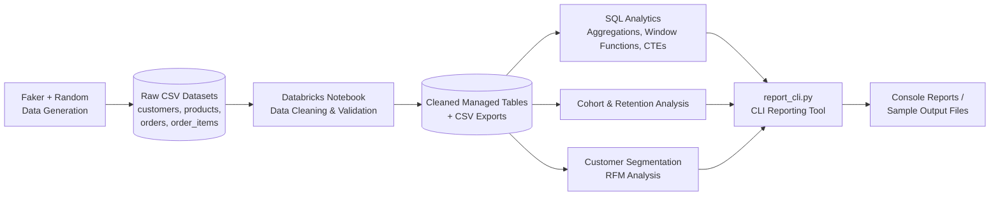
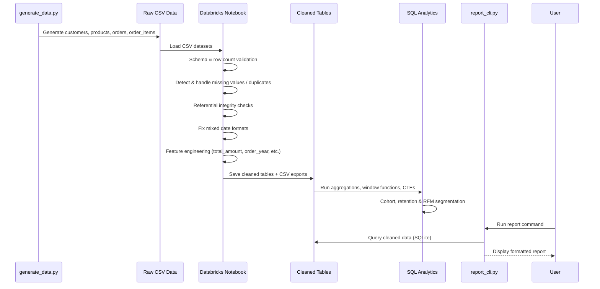

<div align="center">

# 🛒 Week 08 — End-to-End E-Commerce Analytics System

### A complete data engineering & analytics pipeline built with Python, SQL, and Databricks

[](https://www.python.org/)
[](https://community.cloud.databricks.com/)
[](https://spark.apache.org/docs/latest/api/python/)
[](#-sql-analytics)
[](#)
[](#)

*An end-to-end analytics system covering dataset generation, data cleaning, SQL analytics, cohort analysis, customer segmentation, and CLI reporting.*

</div>

---

## 📖 Table of Contents

- [Project Overview](#-project-overview)
- [Architecture Diagram](#-architecture-diagram)
- [Workflow Diagram](#-workflow-diagram)
- [Tech Stack](#-tech-stack)
- [Folder Structure](#-folder-structure)
- [Dataset Description](#-dataset-description)
- [Data Cleaning Workflow](#-data-cleaning-workflow)
- [SQL Analytics](#-sql-analytics)
- [Cohort Analysis](#-cohort-analysis)
- [Customer Segmentation](#-customer-segmentation)
- [CLI Reporting Tool](#-cli-reporting-tool)
- [Installation](#-installation)
- [Requirements](#-requirements)
- [How to Run](#-how-to-run)
- [Example Commands](#-example-commands)
- [Sample Output](#-sample-output)
- [Note on Databricks](#-note-on-databricks)
- [Future Improvements](#-future-improvements)
- [Learning Outcomes](#-learning-outcomes)
- [Author](#-author)

---

## 🧭 Project Overview

**Week 08 – End-to-End E-Commerce Analytics System** is a data analytics pipeline that simulates a real-world e-commerce environment, from raw data generation all the way to business-ready insights.

The project was built as part of an **MCA Data Science & Analytics** program and demonstrates the complete analytics lifecycle:

| Stage | Description |
|-------|-------------|
| 🧪 Dataset Generation | Synthetic e-commerce data created with Faker |
| 🧹 Data Cleaning | Validation, deduplication, and standardization in Databricks |
| 🧮 SQL Analytics | Revenue, ranking, and trend analysis using SQL |
| 📊 Cohort Analysis | Customer retention tracked over time |
| 🧩 Customer Segmentation | RFM-based grouping of customers |
| 💻 CLI Reporting | Command-line tool to generate reports on demand |

---

## 🏗️ Architecture Diagram



---

## 🔄 Workflow Diagram



---

## 🧰 Tech Stack

| Category | Tools |
|----------|-------|
| **Language** | Python |
| **Big Data Processing** | Databricks Community Edition, PySpark |
| **Database / Querying** | SQL, SQLite (CLI demonstration) |
| **Data Manipulation** | Pandas |
| **Synthetic Data** | Faker |
| **CLI Output Formatting** | Tabulate |
| **Version Control** | Git, GitHub |

---

## 📁 Folder Structure

```
ecommerce-analytics-system/
│
├── data/
│   ├── raw/                     # Raw generated datasets
│   └── cleaned/                 # Cleaned datasets exported from Databricks
│
├── notebooks/
│   └── Week_08_Ecommerce_Analytics.ipynb   # Databricks cleaning & analysis notebook
│
├── scripts/
│   ├── generate_data.py         # Synthetic dataset generator
│   ├── clean_data.py            # Reusable data-cleaning workflow
│   └── report_cli.py            # CLI reporting tool
│
├── sql/
│   ├── schema.sql                # Table schemas
│   ├── aggregations.sql          # Revenue & aggregate queries
│   ├── window_functions.sql      # RANK, DENSE_RANK, running totals, moving averages
│   └── cohort_analysis.sql       # Cohort & retention queries
│
├── output/
│   └── sample_reports/           # Example CLI report outputs
│
├── README.md
├── requirements.txt
└── .gitignore
```

---

## 🗃️ Dataset Description

Synthetic datasets were generated using **Faker** and **random**, simulating a realistic e-commerce environment.

| Table | Description |
|-------|-------------|
| `customers` | Customer profile information |
| `products` | Product catalog |
| `orders` | Order-level records |
| `order_items` | Line-item details per order |

To simulate real-world messiness, the following inconsistencies were **intentionally introduced**:

- ❌ Missing values
- ❌ Duplicate rows
- ❌ Invalid dates
- ❌ Invalid foreign keys
- ❌ Mismatched IDs

---

## 🧹 Data Cleaning Workflow

All cleaning was performed inside a **Databricks Notebook**.

| Step | Task |
|------|------|
| 1 | Load CSV datasets |
| 2 | Schema validation |
| 3 | Row count validation |
| 4 | Missing value detection & handling |
| 5 | Duplicate detection & removal |
| 6 | Referential integrity validation (invalid Customer/Product/Order IDs removed) |
| 7 | Mixed date format handling & conversion |
| 8 | Feature engineering: `total_amount`, `order_year`, `order_month`, `order_month_year` |
| 9 | Save cleaned tables as Databricks managed tables + CSV export |

---

## 🧮 SQL Analytics

The following analyses were implemented in SQL:

| Analysis | Technique Used |
|----------|-----------------|
| Revenue per Customer | Aggregation |
| Revenue per Category | Aggregation |
| Monthly Revenue | Aggregation + Date Grouping |
| Top Products by Revenue | Ranking |
| Top Products by Quantity | Ranking |
| Average Order Value (AOV) | Aggregation |
| Customer Lifetime Value | Aggregation |
| Ranking Customers/Products | `RANK()`, `DENSE_RANK()` |
| Running Total of Revenue | Window Function |
| Moving Average of Revenue | Window Function |
| Monthly Revenue Growth | CTEs |

---

## 📊 Cohort Analysis

Customers were grouped into **monthly cohorts** based on their first purchase date, enabling:

- 📆 Cohort-wise order tracking
- 📉 Retention analysis across subsequent months
- 📈 Insight into customer stickiness over time

---

## 🧩 Customer Segmentation

Customers were segmented using:

| Segmentation Type | Basis |
|--------------------|-------|
| Purchase Frequency | Number of orders placed |
| Spend Tier | Total amount spent |
| RFM Analysis | Recency, Frequency, Monetary value |

---

## 💻 CLI Reporting Tool

`report_cli.py` is a command-line reporting tool built on top of the cleaned data (via **SQLite**), supporting the following reports:

- 💰 Revenue
- 👑 Top Customers
- 🏆 Top Products
- 🔁 Retention
- 🧩 Customer Segmentation

Report output is formatted using **Tabulate** for clean, readable console tables.

---

## ⚙️ Installation

```bash
# 1. Clone the repository
git clone https://github.com/<charayadev>/ecommerce-analytics-system.git
cd ecommerce-analytics-system

# 2. Create a virtual environment
python -m venv venv
source venv/bin/activate      # On Windows: venv\Scripts\activate

# 3. Install dependencies
pip install -r requirements.txt
```

---

## 📦 Requirements

See [`requirements.txt`](./requirements.txt) for the full list of dependencies.

---

## ▶️ How to Run

```bash
# Step 1 — Generate the raw datasets
python scripts/generate_data.py

# Step 2 — Clean the datasets
python scripts/clean_data.py

# Step 3 — Run the CLI reporting tool
python scripts/report_cli.py --report revenue
```

> ℹ️ Data cleaning and SQL analytics (aggregations, window functions, cohort analysis) were performed inside the Databricks notebook located at `notebooks/Week_08_Ecommerce_Analytics.ipynb`.

---

## 🧾 Example Commands

```bash
# View revenue report
python scripts/report_cli.py --report revenue

# View top customers
python scripts/report_cli.py --report top-customers

# View top products
python scripts/report_cli.py --report top-products

# View retention report
python scripts/report_cli.py --report retention

# View customer segmentation report
python scripts/report_cli.py --report segmentation
```

---

## 🖥️ Sample Output

```
+----+----------------+-----------+
| ID | Customer Name  | Revenue   |
+----+----------------+-----------+
| 1  | John Doe       | 12,500.00 |
| 2  | Jane Smith     | 10,200.50 |
| 3  | Alex Johnson   | 9,875.75  |
+----+----------------+-----------+
```

> Sample report files are available in [`output/sample_reports/`](./output/sample_reports/).

---

## 🧱 Note on Databricks

- The project was developed using **Databricks Community Edition**.
- The **public DBFS root was disabled**.
- Cleaned datasets were stored as **managed tables** inside Databricks.
- **CSV exports** of the cleaned data are included in this repository for reproducibility outside Databricks.

---

## 🚀 Future Improvements

- [ ] Add automated data quality testing (e.g., Great Expectations)
- [ ] Build an interactive dashboard (Streamlit / Power BI)
- [ ] Schedule pipeline runs with Databricks Workflows
- [ ] Add unit tests for cleaning and reporting scripts
- [ ] Migrate CLI reporting to a lightweight web API

---

## 🎓 Learning Outcomes

Through this project, the following skills were developed and applied:

- End-to-end pipeline design, from raw data to business insights
- Data quality validation and cleaning at scale using PySpark
- Advanced SQL: window functions, CTEs, and ranking functions
- Cohort and retention analysis techniques
- Customer segmentation using RFM analysis
- Building practical CLI tools for data reporting

---

## 👤 Author

**Dev Charaya**
MCA Data Science & Analytics Student

---

<div align="center">

⭐ If you found this project useful, consider giving it a star!

</div>